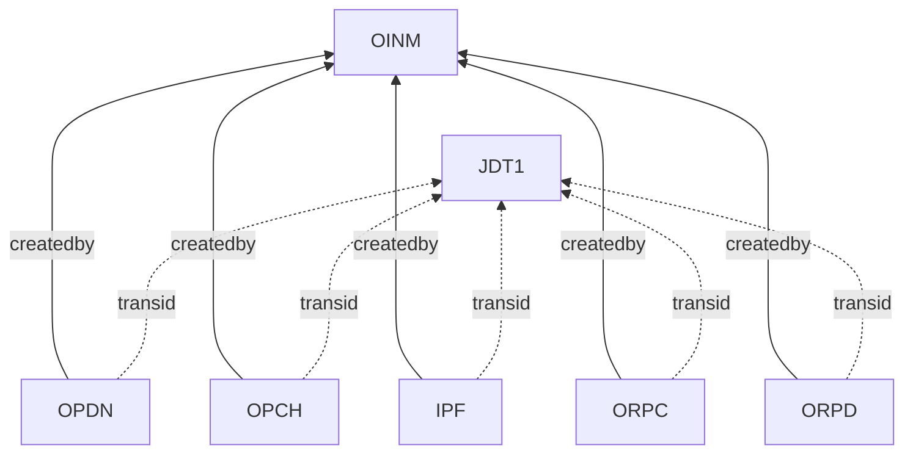
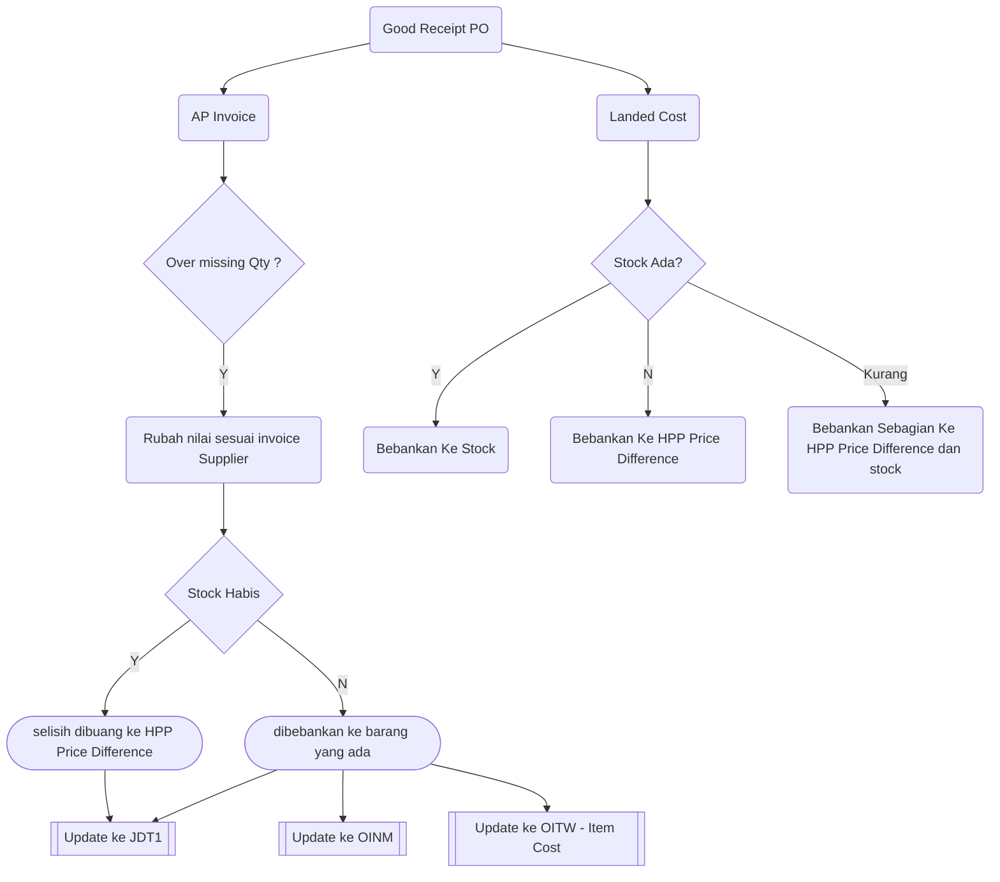

# SAP Pembelian  
## Checklist dan troubleshoot


## Gambaran Umum

Di SAP Business One Pembelian terdiri dari 8 komponen

|SAP Transtype Code | Name |Table Name |
| ------ | ------| ------|
| 22 | Purchase Order|OPOR|
| 20 | Good Receipt PO|OPDN|
| 18 | AP Invoice|OPCH|
| 19 | AP Credit Memo|ORPC|
| 21 | Good Return|ORPD|
| 30 | Jurnal Entry|JDT1|
| 69 | Landed Cost|IPF|

Semua komponen diatas bermuara di 2 table utama SAP, yaitu OINM ( Inventory Audit Report) , dan JDT1 ( Jurnal Entry)



## Laporan Pembelian 

Dapat Dicek dari 4 bagian modul
* **1. Purchase Analysis SAP**
* **2. Inventory Audit Report Query**
* **3. General Ledger**
* **4. Laporan HPP Global**


**1. Purchase Analysis SAP**

Menu --> Purchase Analysis Item


Menu --> Purchase Analysis  


Catatan :
Laporan *Purchase Analysis* SAP Business total tidak termasuk **Freight**, dan **Landed Cost**  

Laporan *Purchase Analysis* dan *Purchase Analysis Item* bisa berbeda karena beberapa hal
* *Adanya AP Services*
* *Adanya AP Credit Memo Services*

Laporan Pembelian SAP berdasarkan AP invoice Dan good Receipt PO. Jika terjadi perbedaan antara GR dan AP , maka akan timbul **jurnal HPP** di AP invoice




**2. Inventory Audit Report Query**

```sql
declare         
			    @v_Pembelian     float	, 
				@v_landed        float	,
				@v_TotalHPP		 float	,
                @v_landedHPP     float
/*
Pembelian dari Inventory Audit Report
*/                
select @v_Pembelian = sum( a.transvalue) 
from    OINM A WHERE   CONVERT( VARCHAR, A.DOCDATE ,112) >= (@datefrom)  and   CONVERT( VARCHAR, A.DOCDATE ,112) <= (@dateto)   AND transtype in (20,19,21,18)

/*
Landed Cost dari Inventory Audit Report
*/                
select @v_landed= isnull(sum( a.transvalue) ,0)
from    OINM A WHERE   CONVERT( VARCHAR, A.DOCDATE ,112) >= (@datefrom)  and   CONVERT( VARCHAR, A.DOCDATE ,112) <= (@dateto)   AND transtype in (69)

/*
Landed Cost dari Jurnal , yang khusus account 5 ( HPP )
*/                
 
select @v_landedHPP  =isnull(sum (debit-credit),0) 
 From jdt1 where left(account,1)='5' 
and  CONVERT( VARCHAR, refdate ,112) >= (@datefrom)  and   CONVERT( VARCHAR,refdate ,112) <= (@dateto) 
and transtype=69

select          'Pembelian',isnull(@v_Pembelian,0) Pembelian 
union all
select          'Landed Cost',isnull(@v_landed,0) Landed  
union all
select          'Landed Cost (HPP)',isnull(@v_landedHPP,0) Landedhpp  
```

**Cek Nilai Landed Cost**

Total Landed A  = Total Landed di Inventory + Total Landed Di GL komponen HPP ( transtype=Landedcost)  
Total Landed B = GL komponen 2140 yang dari jurnal Entry (30)

*Total Landed A = Total Landed B* = *Total Landed Cost*


**3. General Ledger**

Total Pembelian = GL (1190) Komponen (20,19,21,18,69) + GL (5) Komponen  (20,19,21,18,69) 


**4. HPP Global**

Landed Cost HPP = Landed Cost dari GL (5)  yang tidak bisa dibebankan ke item barang  
Landed Cost Item= Landed Cost dari GL (5)  yang  dibebankan ke item barang

Total Pembelian = Total Pembelian + Landed Cost Item + Landed Cost HPP


<!--stackedit_data:
eyJoaXN0b3J5IjpbMTU2Mjk1Mjg0Niw4MjIyMDY4NDQsLTIxND
A4MDUyNDgsOTM5ODAxMTQsLTMxODczMDM0LDE5NzEwNjIyMjgs
LTMxODczMDM0LDE3NzQxMDg3OTcsLTEwMjkxODkyOTksLTU5MT
U3OTI4MywtMTU4NTY0MjQ0NSw0NzQ5OTQ2NjQsLTI1Nzc3MDk0
OCwxMjE3ODkxMjMsMjA5MzY2OTgxOSwtNzIxMjE1NjExLC00MD
U5NDA3ODgsLTEwODUxNTE2MzEsLTE2OTIwODU1MzNdfQ==
-->