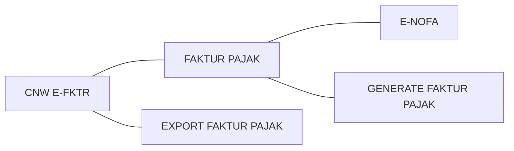

# CNW Faktur
## Petunjuk Penggunaan

    Input E-Nofa, Generate Faktur pajak , kemudian upload ke DJP
    

# Menu

## Menu E-Nofa

Input Nomor E-Nofa dari DJP, untuk penomoran Faktur pajak

<!--stackedit_data:
eyJoaXN0b3J5IjpbLTU1NzI5Mzc4NSwtMTQ2MjQ1OTI1NSwtOD
YxOTIwOTg1LDEyNTI1NTU0MzBdfQ==
-->