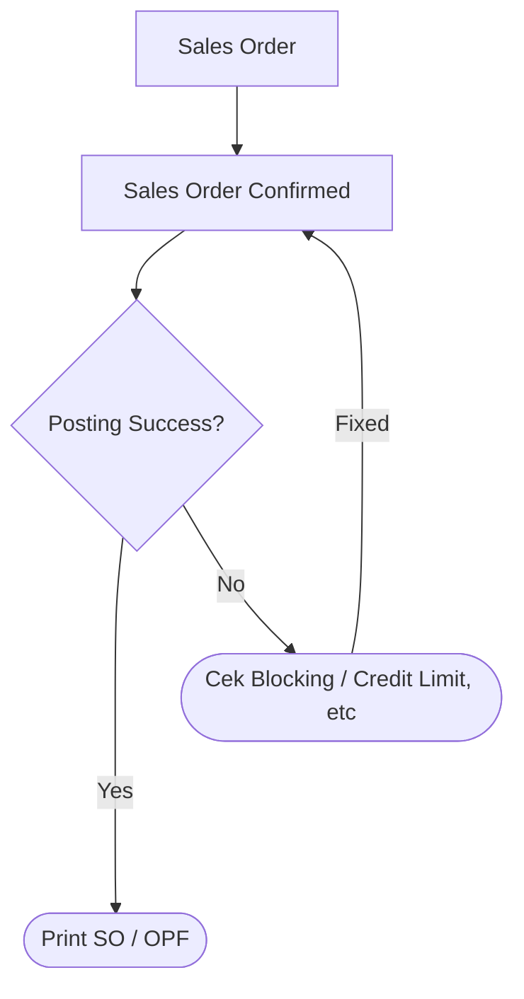

# **CNW TRC**

## *Panduan Penggunaan*  

	Author : Dika , Andy
	Version : 1.1

----

[toc]  


----

## Keterangan

Modul TRC merupakan tracking dan prepare dokumen untuk menyiapkan barang di gudang. terdiri dari 3 bagian utama
1. Get Data dari SAP Business One
2. Check List Sales Admin untuk dikirim ke gudang
3. Checklist Gudang untuk penerimaan SO, dan prepare untuk barang
4. Print Out tally dan Picking berdasarkan Jalur.


## Alur Dokumen

### Pembuatan SO /OPF

### Checklist SO / OPF di Sales

```mermaid

```


<!--stackedit_data:
eyJoaXN0b3J5IjpbMTEyOTkwNjMyOSwxODk0OTcwMjI0LC0xMj
I3MTM1MzMwLDE2MjQ5Mjg3MTEsLTE1ODkzNTM1NzMsOTcxMjc4
NjcxXX0=
-->