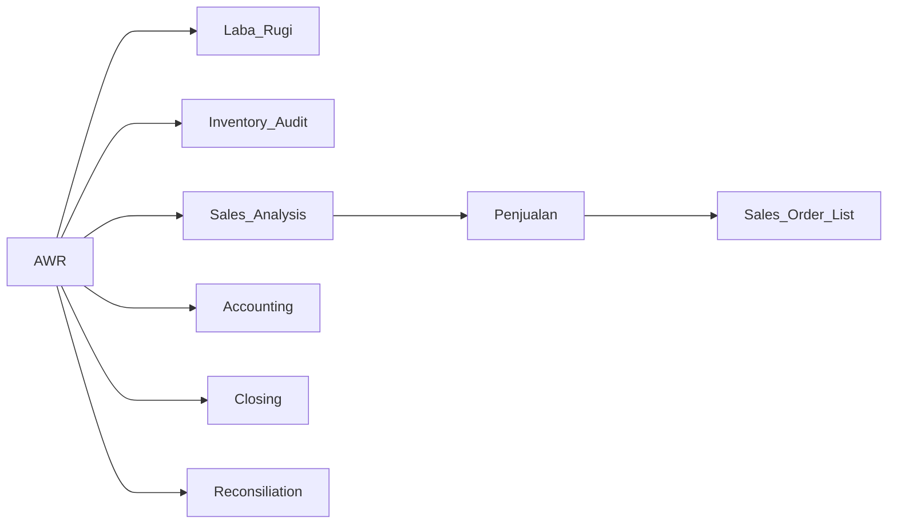
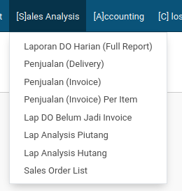
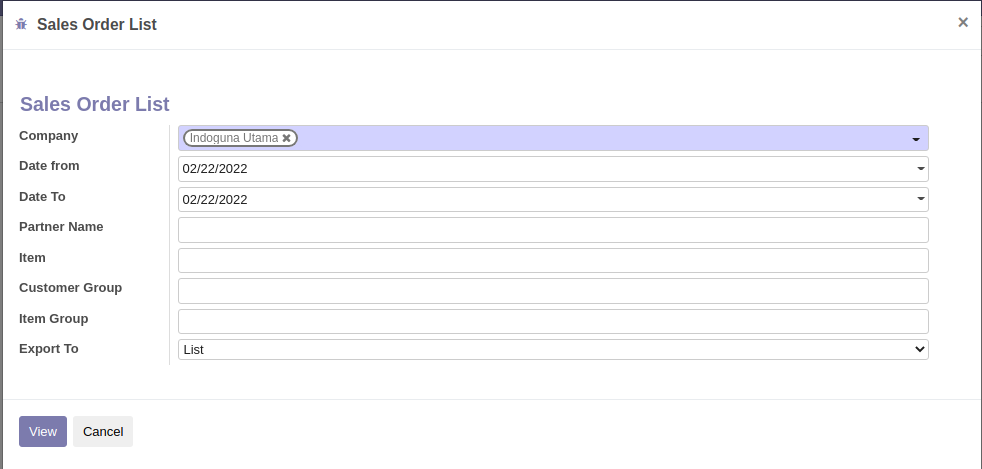
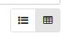
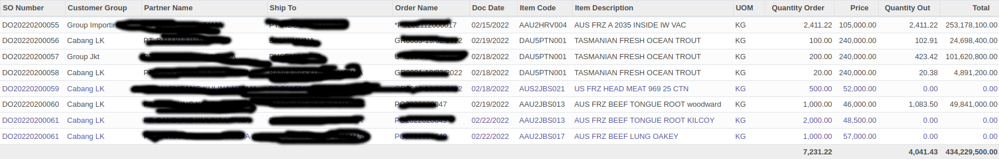
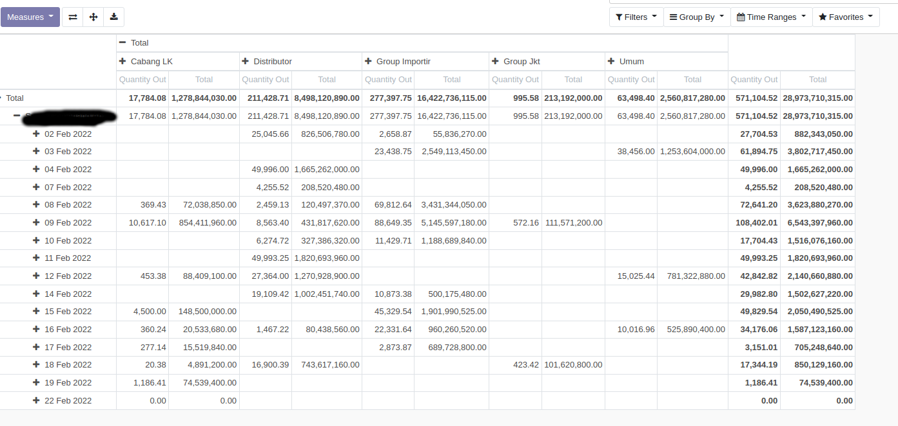

# Sales Order List 

_Document Type :Markdown_
_Document Date :2022-02-22_
_Version : 1.0.0_ 
_Author : Andy_

---
## Keterangan / Summary 

Data penjualan detail berdasarkan SO dan DO d SAP

## Menu

**MENU**

Ada di **CNW-AWR28** --> **Sales Analysis** --> **Penjualan** --> **Sales Order List**

## Petunjuk Penggunaan

### Form Wizard

* **Company** : Pilih Company yang dituju
* **DateFrom** : Pilih tanggal Awal Transaksi (Tanggal SO)
* **Dateto** : Pilih tanggal Akhir Transaksi (Tanggal SO)
* **Partner Name** : Isi dengan kode customer atau nama customer (Optional)
* **Item** : Isi dengan Kode atau nama barang (Optional)
* **Customer Group** : Isi dengan nama group customer (Optional)
* **Item Group** : Isi dengan nama group barang (Optional)
* **Export To** : Pilihan untuk generate data ( dalam List TreeView, Excel, Atau ListPDF)

### Tree View ( List )

Dalam Tree View ada 2 opsi tampilan, List dan Pivot

Yang kiri Menu TreeView, yang kanan PivotView

**TreeView (Default)**

> Jika Baris berwarna **Ungu** artinya quantity barang yang dikeluarkan = **0**

**PivotView (Analysis)**

> Secara default, pivot akan menampilkan penjualan perhari , berdasarkan group customer. berdasarkan data dari **DO** (Potong Stock)