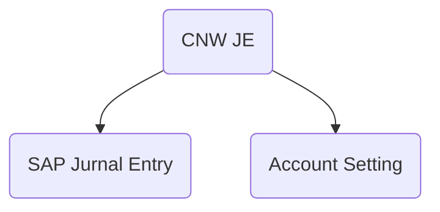
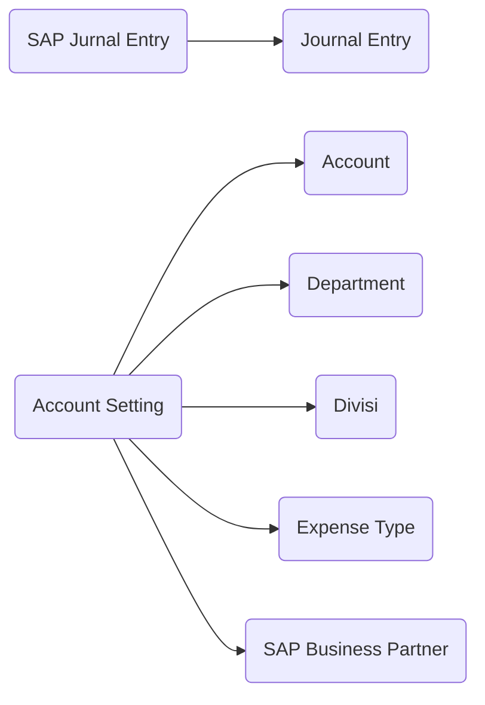
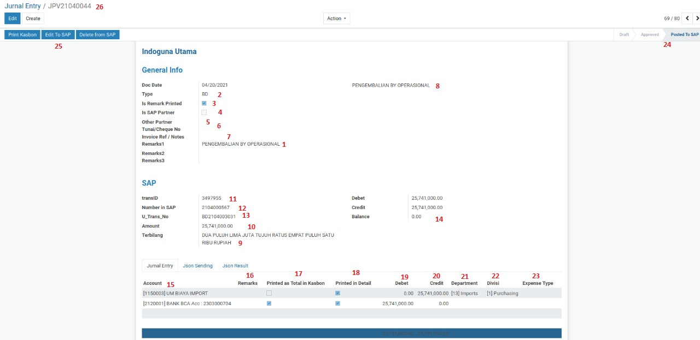
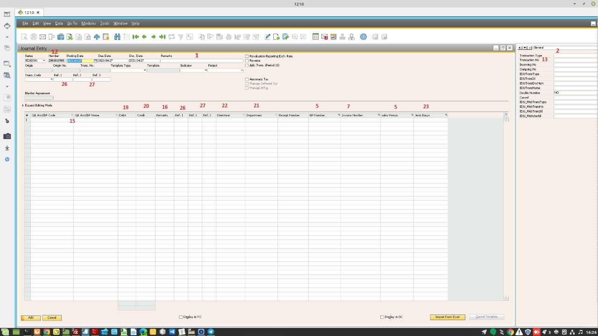
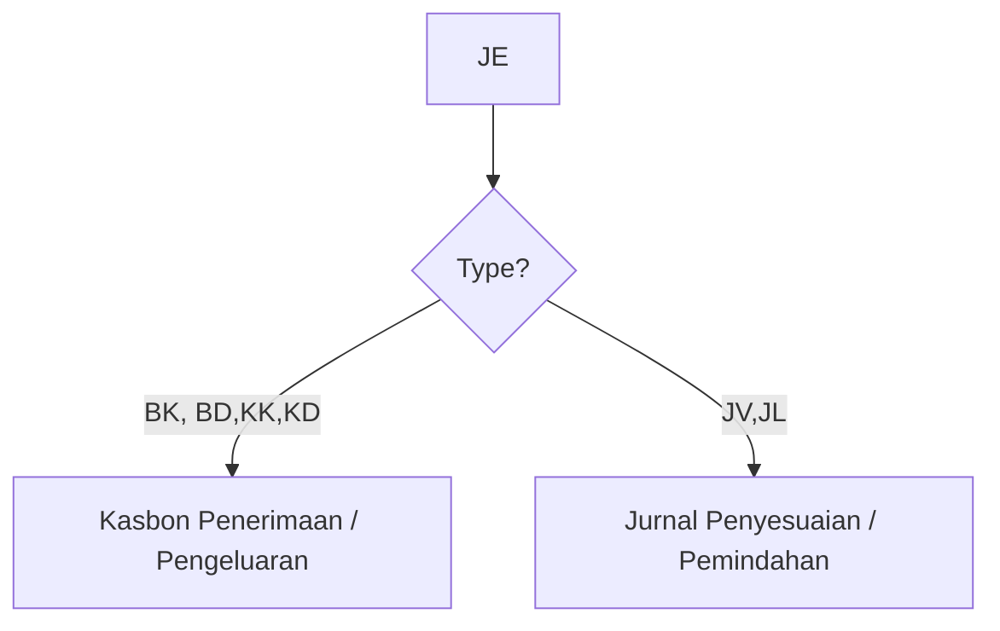
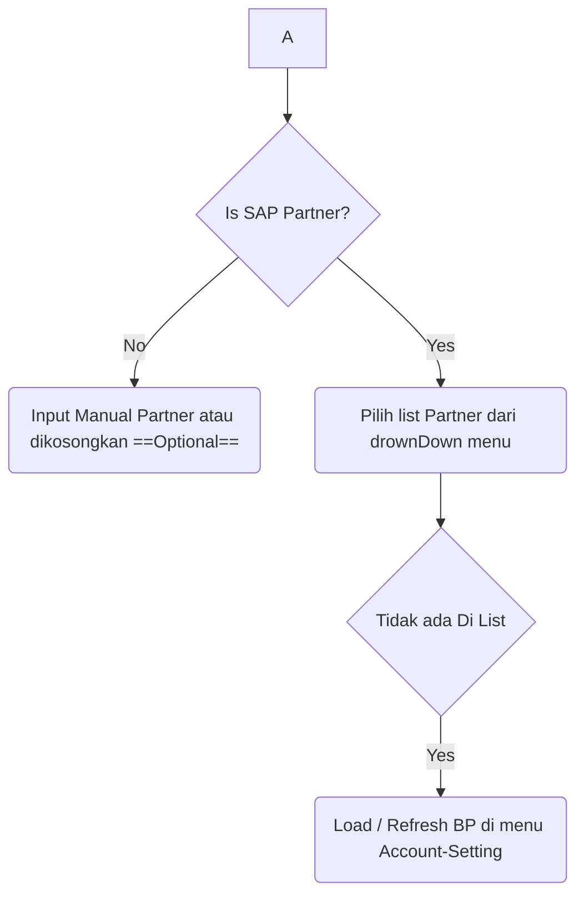
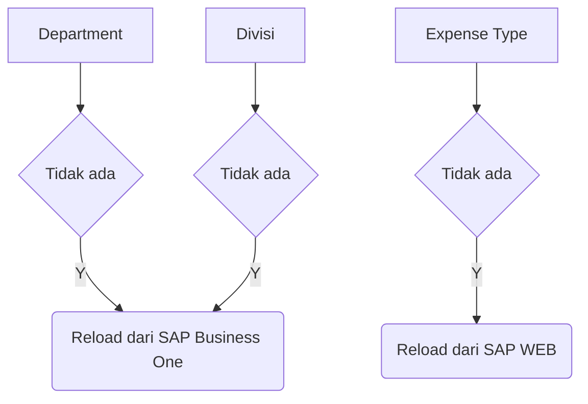
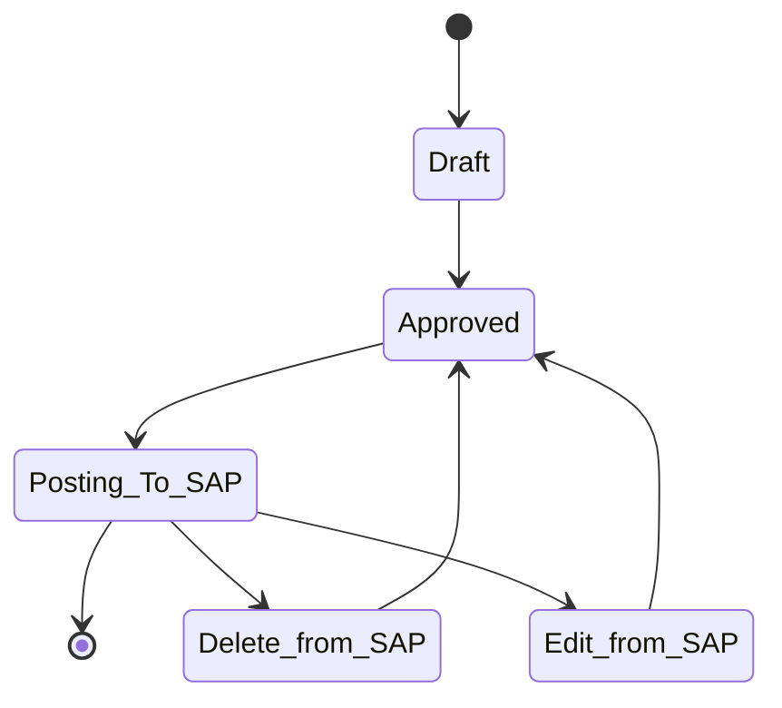

# CNW JE ( Jurnal Entry SAP)
## Petunjuk Penggunaan


###### Generated Using : *Markdown Mermaid*
###### Version : *1.0*
  
---

---
## Keterangan  

CNW JE modul yang digunakan untuk memasukan **Jurnal Entry SAP** menggunakan ***web Services Intidata***.  Mencakup Jurnal entry, cost center, control account, cetakan vocher.

### Menu 


### Sub Menu




## SAP Jurnal Entry -> Jurnal Entry

### Form View


Mapping dengan SAP Business One




### Field 
**(26) Name** : Nomor Internal Jurnal Entry CNW
**Company** : Company yang aktif
**Doc Date** : Tanggal dokumen
**(2) Type** : Jenis Jurnal Entry


Daftar Jenis Tipe Jurnal Entry :
* JL : Jurnal Lain
* JV : Jurnal Penyesuaian
* BK : Bank Kredit
* BD : Bank Debet
* KK : Kas Kredit
* KD : Kas Debet


	Jika pilihan BK, BD, KD, KK maka cetakannya akan muncul jenis cetakan *Voucher pengeluaran/penerimaan kas/bank*. Jika pilihannya JV,JL maka cetakannya akan muncul cetakan *Jurnal Penyesuaian / Pemindahan*




Penomoran SAP berdasarkan pilihan Type ini 

```python
[bk] = [BK]{year}{month}[999999]
[bd] = [BD]{year}{month}[999999]
[kk] = [KK]{year}{month}[999999]
[kd] = [KD]{year}{month}[999999]
[jv] = [JV]{year}{month}[999999]
[jl] = [JL]{year}{month}[999999]
```

**(3) Is Remark Printed** : Remark di line di print pada voucher di Jurnal Penyesuaian, jika tidak di ==Thick==  maka remark nya dicetak  

**(4) Is SAP Partner** : Berhubungan dengan SAP business Partner atau tidak




Catatan : Untuk COA Tipe **Control Account** ,  Check List ini harus posisi **Yes**, karena kode BP tersebut akan masuk ke dalam ***CardCode*** Didalam Table Jurnal entry (  *JDT1* )

**(5) Partner SAP** : Dropdown untuk memilih SAP Partner, jika tipe Account menggunakan **Control Account**  maka akan masuk ke dalam CardCode di JDT1 , dan Business Card ID di UDF JDT1.  Jika Tidak menggunakan **Control Account** maka akan ditempel nama customer di field remarks

**(5) Other Partner** : Partner diluar SAP business One Partner.  
**(6) Tunai/Cheque No** : Kolum untuk memasukan Nomor Cheque .  
**(7) Invoice Ref / Notes** : Nomor Invoice Referensi
**(1) Remark 1** : Kolom keterangan ==(Wajib Diisi)==.  
**(1) Remark 2** : Kolom keterangan tambahan (baris 2).  
**(1) Remark 3** : Kolom keterangan tambahan (baris 3) .  
**(8) Remark 4** : Kolom keterangan Dalam bentuk HTML .  
**(10) Amount** :  Total nilai dari baris yang di *thick* "Printed as Total in Kasbon"
**(11) transID** :  Nomor ID JE SAP Business One  
**(12) Number in SAP** : Kode ==Number==  JE Header SAP Business One  
**(13) U_Trans_No** : Nomor Transaksi Akuntansi SAP Business One  
**(14) Debit, Credit, Balance** : Nilai dibaris Jurnal Entry, Balance **harus = 0**  
**(15) Account** :Account dari SAP Business One    
**(16) Remark** : Keterangan baris   
**(17) Printed as Total In Kasbon** : Jika checklist, maka akan dihitung nilai dari *absolut (Debet - Credit)* , dan terbilangnya. nilai ini yang akan muncul di cetakan kasbon ( khusus untuk BK , BD, KK , KD)    
**(18) Printed in Detail** :  Baris ini dicetak saat print perincian detail jurnal Entry
**(19) Debit** : Nilai debet   
**(20) Credit** : Nilai credit   
**(21) Departmen, (22) Divisi , (23) Expense Type** : Departmen, Divisi dan Expense Type dari SAP   


**(24) Status** : Status dokumen JE ( Draft, Approved, Posted to SAP)



**(25) Tombol Action** : Tombol Action  


<!--stackedit_data:
eyJoaXN0b3J5IjpbMzM4NTAyMTQ3LC0xNTk1MjIzNTA3LC01MD
MzNzE5NjcsLTczNzMxNjM2MywxNjU0NzExODEsLTEwMzk5MDkz
MzIsMTgxMDAwNzg0MywyMDY3MTI5Mzk2LDE1MDE1ODE5NDMsMT
QxMDQ4NTA3MywyMTE0NTAzNTEwLC0xNTQ5MzkxMjIxLC0xNzgz
Mzg2Mjc1LC0yMDQ4MjMzMTQxLC0xNDgyODUwMDA4LC02ODgyNT
EyMTIsLTg5NTY0NzI3MiwxMTAwODM4NzY2LC0xMTYwMDcxNDU5
LDE4NTgwNDMxOF19
-->