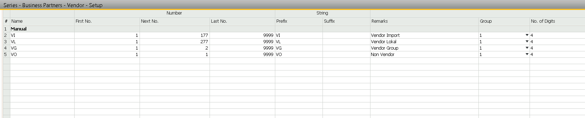
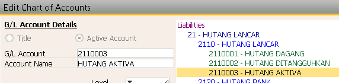

## Pembelian Aktiva SAP 

**Keterangan :**

Digunakan untuk pembelian ATK, ASET, Mesin dll

### Konfigurasi 

**[SAP B1]**

* Buat Group Non Vendor Dengan kode VO

* Buat COA baru hutang non barang dagang

* Buat kelompok Item Baru dengan ketentuan 
    * Checklist inventory dimatikan
    * Group Accounting lari ke biaya

 

**[SAP B1]**

* Buat Group Non Vendor Dengan kode VO
* Buat COA baru hutang non barang dagang
* Buat kelompok Item Baru dengan ketentuan 
* checklist inventory dimatikan
* Group Accounting lari ke biaya

