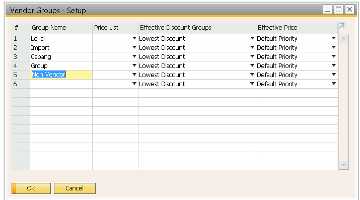
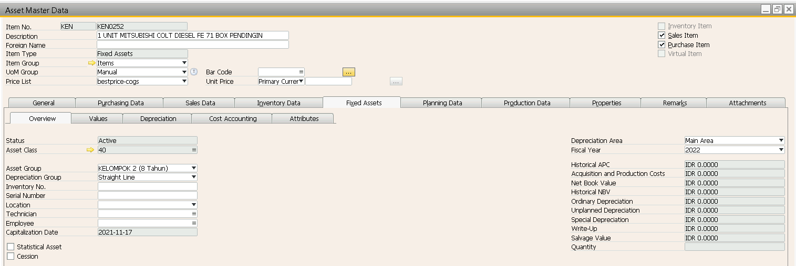

## Pembelian Aktiva SAP 

**Keterangan :**

Digunakan untuk pembelian ATK, ASET, Mesin dll

    **Semua pembayaran untuk pembelian Asset harus menyertakan PO SAP**

### Konfigurasi 

**[SAP B1]**

* Buat Group Non Vendor Dengan kode Numbering VO

> Document Numbering -> vendor
> 

> Setup -> Business Partner -> vendor Group 
> 

* Buat kelompok Item Baru dengan ketentuan 
    * Checklist inventory dimatikan
    * Group Accounting lari ke biaya

 

* Buat COA baru hutang non barang dagang

* Buat kelompok Item Baru dengan ketentuan 
    * Checklist inventory dimatikan
    * Group Accounting lari ke biaya

 

### Prosedur

1. Bagian Procurement /purchasing membuat form _purchase request_
2. Kemudian diserahkan ke bagian _Accounting_ untuk dicek apakah aktiva atau biaya
3. Kemudian bagian _Accounting_ membuat **Fixed Asset Master Data** di SAP sesuai dengan Kriteria Asset yang ditentukan

4. kemudian **Kode Master Data** tersebut diberikan ke bagian Procurement untuk dibuatkan PO

5. Bagian Procurement / Purchasing membuat Purchase Order sesuai kode yang dibuat oleh bag _Accounting_
6. Purchase Order tersebut diserahkan ke bagian Accounting untuk diproses pembayaran dan pengakuan assetnya

    Jurnal yang terbentuk :
        [1] UM Aktiva 
                Hutang Aktiva
                
        [2] Asset 
                UM Aktiva

    Pembayaran dibayar dengan jurnal Manual :
        [3] Titipan 
                Bank

7. Setelah barang lengkap, bagian accounting membuat **AP Invoice** copy from **PO** Asset tersebut

            

    Pembayaran dibayar dengan Outgoing Payment :
        [4] Hutang Aktiva
                Titipan
