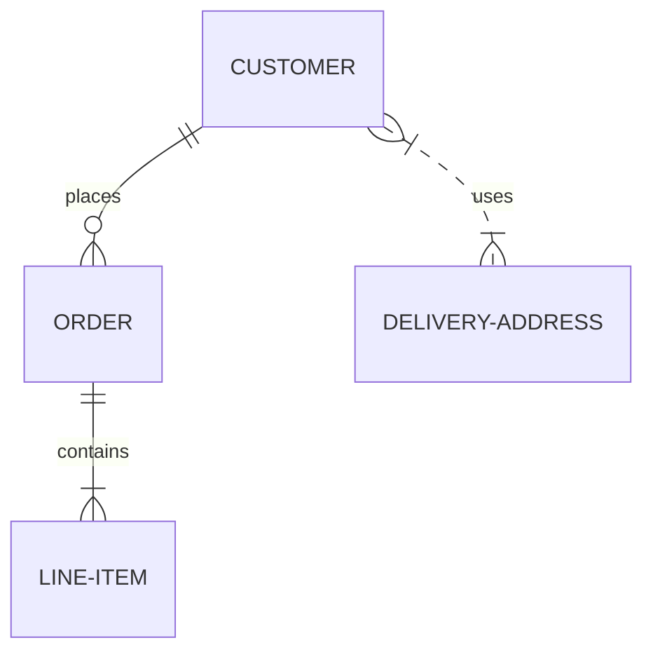

## Trading Term monitoring SAP

> Modul Trading Term SAP

**Keterangan**

### Alur Kerja

#### Sales

1. Sales Input Trading term sesuai dengan kontrak customer 

> **TRDM -> List Trading Term**

> **Klik Create**

#### Accounting
- Business Partner
- group Barang
- Sub Group Barang
- Expense Item

