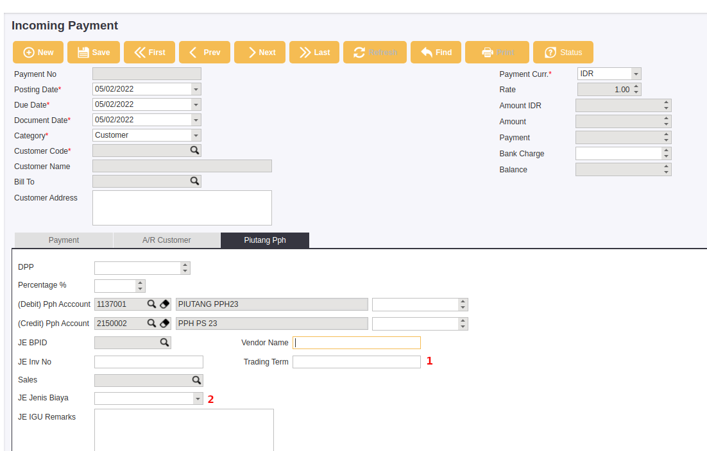

## Trading Term  SAP

---
    Document : markdown + Mermaid
    Generator : MKDOcs

---

 

### Alur Kerja

1. Sales Input Trading Term sesuai kontrak
2. Accounting input nomor trading term dan jenis biayanya saat input pembayaran ( input tagihan potongan)
3. Biaya biaya diluar trading term diinput Accounting di jurnal Entry dengan memasukan jenis biaya dan kode customer SAP
4. Semua data penjualan dan pembayaran otomatis ditarik dari SAP berdasarkan kode customer, dan jenis item nya.

5. Waktu **Calculate**, sistem akan mengambul penjualan SAP, pembayaran, dan biaya yang sudah diinput sesuai nomor _trading term_ nya, serta biaya biaya diluar trading term.
   

### Cara Input

#### Sales

1. Sales Input Trading term sesuai dengan kontrak customer 

> **TRDM -> List Trading Term**

> **Klik Create**

**General**

1. Docdate : Tanggal Trading Termnya 
2. Period From : Tanggal mulai trading term
3. Period To : Tanggal berakhirnya Trading Term
4. Partner : Customer di SAP
5. Target : Target Penjualan dalam kontrak _trading term_

**Item**

1. Item Group : group barang yang dikenakan
2. item sub Group : Sub Group barang yang dikenakan (_optional_)
3. Brand : Merk barang yang dikenakan oleh trading term tersebut (_optional_)
4. Ref : Nomor referensi ( Nomor kontrak )
5. Doc File : File Kontrak

**Line**

1. Trading Type : Tipe jenis trading nya 
2. Remarks : Keterangan tambahan
3. Type : 
   * Nominal : Nilai jenis biayanya 
   * Percent : Persentase dari nilai target.
4. Values : nilai yang dihitung dari type diatas
5. Amount : nilai estimasi trading term, dihitung dari _target_ dan _values_ 
6. Realisasi : Nilai realisasi dari accounting selama periode trading.
7. Difference : Amount - Realisasi

#### Accounting

Saat menerima tagihan trading term, pihak AR / Accounting input di SAP incoming Payment, dengan mengisi nomor trading term dan jenis biayanya sesuai arahan dari pihak Sales

1. Nomor Trading Term
2. Jenis Biaya Trading term

    Sesuai dengan daftar diatas berdasarkan inputan dari sales.

