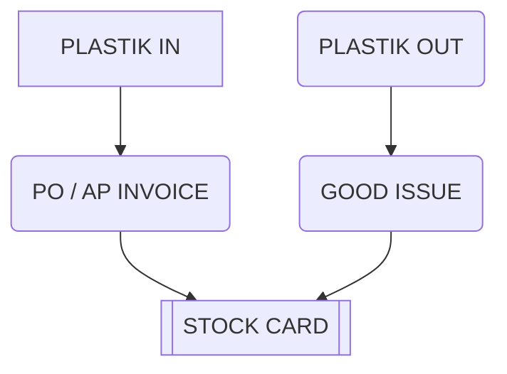
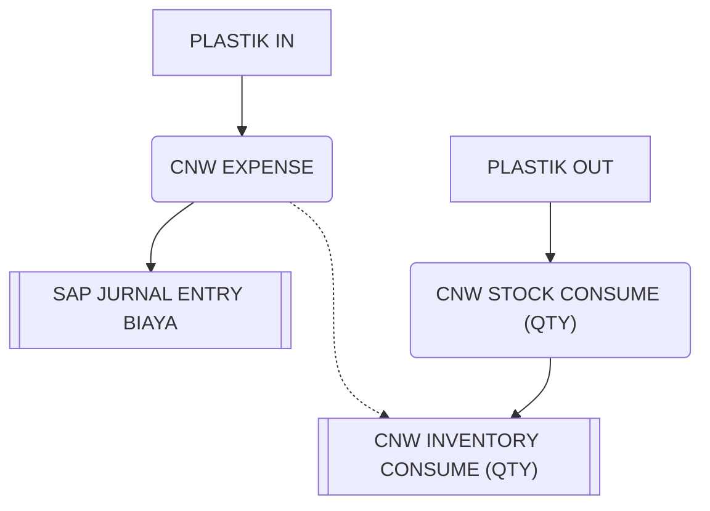

# Pembelian Plastik

## Skema 1
### Masuk dalam stock SAP

## Skema 2
###  Biaya di SAP, stock card diluar SAP

<!--stackedit_data:
eyJoaXN0b3J5IjpbMTQ5NjcwNDM1NiwtMTcwNTY4MDQ5NCwtNz
MyMTc2ODI2LDEyNTMxOTE0MDJdfQ==
-->